  <picture>
    <source media="(prefers-color-scheme: dark)" srcset="assets/banner.svg">
    
  </picture>

 

## 👨‍💻 About

**Lead Software Engineer** @ [Polygon Technology](https://polygontechnology.io) · Bangladesh

I engineer **deterministic infrastructure for AI agent workflows** — gated SDLC pipelines that make agent-driven development auditable, replayable, and production-safe. From orchestration engines to high-throughput scraping systems, I build the layer between AI decisions and production reality.

📍 Bangladesh · 🐙 [@tonmoy007](https://github.com/tonmoy007) · 💼 [in/tonmoy46](https://linkedin.com/in/tonmoy46)

 

## 🛠 Core Stack

  
  
  
  
  
  
  
  
  
  
  
  

 

---

## 📦 Featured Work

### 🔧 [forge-os](https://github.com/tonmoy007/forge-os)
> Local-first SDLC orchestration CLI · 12-stage lifecycle · Quality gates · Replayable agent runs
> `🟢 Active`

### 🔌 [forge-plugins](https://github.com/tonmoy007/forge-plugins)
> Gated orchestrator for Claude Code · REQ-ID traceability · Cost-capped background agents
> `🟢 Active`

### 📚 [religious-study](https://github.com/tonmoy007/religious-study)
> Comprehensive Obsidian vault · 12+ scripture traditions · Cross-referenced analysis
> `🟢 Active`

### 🕯️ [auri](https://github.com/tonmoy007/auri)
> Anonymous AI-driven confession booth · Whisper STT · Voice modulation · 3D R3F booth · Telegram delivery
> `🟢 Active`

 

---

## 📊 Activity

  

  
    <code>41 repos</code> &nbsp;·&nbsp; <code>11 stars</code> &nbsp;·&nbsp; <code>4 followers</code> &nbsp;·&nbsp;
    
  

 

---

## 🏆 Achievements

  
  
  

 

---

## 📬 Connect

  
  
  

  <i>© 2026 Saddam Hossain · Built with ☕ and code</i>

