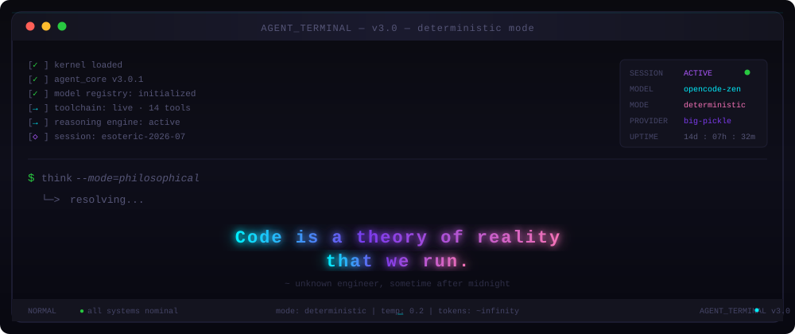
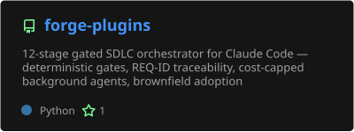
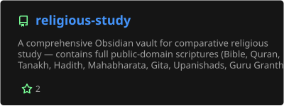
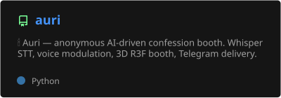
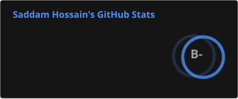
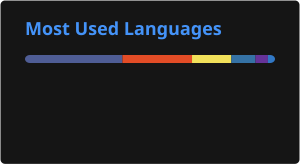

    

  <picture>
    <source media="(prefers-color-scheme: dark)" srcset="assets/banner.svg">
    
  </picture>

 

## 👨‍💻 About

**Lead Software Engineer** @ [Polygon Technology](https://polygontechnology.io) · Bangladesh

I engineer **deterministic infrastructure for AI agent workflows** — gated SDLC pipelines that make agent-driven development auditable, replayable, and production-safe. From orchestration engines to high-throughput scraping systems, I build the layer between AI decisions and production reality.

📍 Bangladesh · 🐙 [@tonmoy007](https://github.com/tonmoy007) · 💼 [in/tonmoy46](https://linkedin.com/in/tonmoy46)

 

## 🛠 Core Stack

  
  
  
  
  
  
  
  
  
  
  
  

 

---

## 📦 Featured Work

<!--

    <table align="center" border=0>
        <tr>
            <td valign="middle" align="center" border="none"></td>
            <td valign="middle" align="center" border="none"></td>
        </tr>
        <tr>
            <td valign="middle" align="center" border="none"></td>
        </tr>
    </table>

-->

  

    
    
  

  

    
  

 

---

## 📊 Activity & Stats

<!--

  <table border="0" align="center">
    <tr>
      <td valign="middle" align="center">
        <picture>
          <source srcset="assets/stats.svg" media="(prefers-color-scheme: dark)" />
          
        </picture>
      </td>
      <td valign="middle" align="center">
        <picture>
          <source srcset="assets/top-langs.svg" media="(prefers-color-scheme: dark)" />
          
        </picture>
      </td>
    </tr>
  </table>

-->

    

        
        
    

 

  <picture>
    <source media="(prefers-color-scheme: dark)" srcset="assets/snake.svg">
    
  </picture>

 

---

## 🏆 Achievements

  
  
  

 

---

## 📬 Connect

  
  
  

  <i>© 2026 Saddam Hossain · Built with ☕ and code</i>

